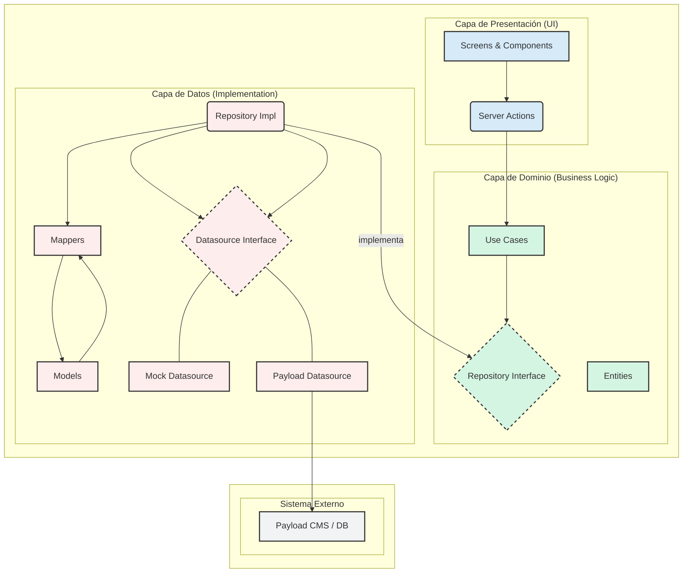

# Entity Relation — Nexus Academy

## Auth

### UserEntity
| Atributo | Tipo | Descripción |
|---|---|---|
| `id` | `string` | Identificador único |
| `email` | `string` | Correo electrónico |
| `name` | `string` | Nombre completo |
| `avatarUrl` | `string?` | URL del avatar |
| `provider` | `"google" \| "cas-uci" \| "credentials"` | Proveedor de autenticación |

**Relaciones:**
- 1:N → `EnrollmentEntity` (via `userId`)
- 1:N → `BookmarkEntity` (via `userId`)
- 1:N → `AssessmentEntity` (via `userId`)
- 1:1 → `PreferenceEntity` (via `userId`)
- 1:N → `CollectionEntity` (via `userId`)
- 1:N → `NavigationHistoryEntity` (via `userId`)
- 1:N → `SearchHistoryEntity` (via `userId`)

---

### ProfileEntity
| Atributo | Tipo | Descripción |
|---|---|---|
| `user` | `UserEntity?` | Datos del usuario |
| `preferences` | `PreferenceEntity?` | Preferencias del usuario |

**Relaciones:** Composición de `UserEntity` + `PreferenceEntity`

---

## Courses

### CourseEntity
| Atributo | Tipo | Descripción |
|---|---|---|
| `id` | `string` | Identificador único |
| `title` | `string` | Título del curso |
| `description` | `string` | Descripción |
| `level` | `"beginner" \| "intermediate" \| "advanced"` | Nivel de dificultad |
| `durationHours` | `number` | Duración total en horas |
| `rating` | `number` | Calificación promedio |
| `reviewCount` | `number` | Cantidad de reseñas |
| `featured` | `boolean` | Si está destacado |
| `progress` | `number?` | Progreso del usuario actual (0-100) |
| `thumbnailUrl` | `string` | URL de la miniatura |
| `authorName` | `string?` | Nombre del autor |
| `authorAvatarUrl` | `string?` | Avatar del autor |
| `modules` | `CourseSectionEntity[]` | Módulos/secciones del curso |

**Relaciones:**
- 1:N → `CourseSectionEntity` (via `modules`)
- 1:N → `EnrollmentEntity` (via `courseId`)
- 1:N → `BookmarkEntity` (via `courseId`)
- 1:N → `AssessmentEntity` (via `courseId`)
- N:M → `CareerPathEntity` (via `CareerPathMilestoneEntity.courseIds`)

---

### CourseSectionEntity
| Atributo | Tipo | Descripción |
|---|---|---|
| `id` | `string` | Identificador único |
| `title` | `string` | Título de la sección |
| `resources` | `ResourceEntity[]` | Recursos dentro de la sección |

**Relaciones:** 1:N → `ResourceEntity` (via `resources`)

---

## Career Paths

### CareerPathEntity
| Atributo | Tipo | Descripción |
|---|---|---|
| `id` | `string` | Identificador único |
| `slug` | `string` | Slug para URL |
| `title` | `string` | Título de la ruta |
| `description` | `string` | Descripción |
| `featured` | `boolean` | Si está destacada |
| `estimatedHours` | `number` | Horas estimadas totales |
| `coursesCount` | `number` | Cantidad de cursos incluidos |
| `level` | `"beginner" \| "intermediate" \| "advanced"` | Nivel de dificultad |
| `milestones` | `CareerPathMilestoneEntity[]` | Hitos que componen la ruta |

**Relaciones:** 1:N → `CareerPathMilestoneEntity` (via `milestones`)

---

### CareerPathMilestoneEntity
| Atributo | Tipo | Descripción |
|---|---|---|
| `id` | `string` | Identificador único |
| `title` | `string` | Título del hito |
| `courseIds` | `string[]` | IDs de los cursos asociados |
| `order` | `number` | Orden dentro de la ruta |

**Relaciones:** N:M → `CourseEntity` (via `courseIds`)

---

## Resources

### ResourceEntity
| Atributo | Tipo | Descripción |
|---|---|---|
| `id` | `string` | Identificador único |
| `courseId` | `string` | ID del curso al que pertenece |
| `title` | `string` | Título del recurso |
| `type` | `"video" \| "pdf" \| "form" \| "document" \| "ebook" \| "article" \| "audio" \| "image" \| "code" \| "interactive" \| "presentation"` | Tipo de recurso |
| `resourceUrl` | `string` | URL del recurso |
| `durationMinutes` | `number` | Duración en minutos |
| `completed` | `boolean` | Si el usuario actual lo completó |
| `order` | `number` | Orden dentro de la sección |

**Relaciones:**
- N:1 → `CourseEntity` (via `courseId`)
- 1:N → `BookmarkEntity` (via `resourceId`)
- 1:N → `AssessmentEntity` (via `resourceId`)

---

## Enrollments

### EnrollmentEntity
| Atributo | Tipo | Descripción |
|---|---|---|
| `id` | `string` | Identificador único |
| `userId` | `string` | ID del usuario |
| `courseId` | `string` | ID del curso |
| `progressPercent` | `number` | Progreso (0-100) |
| `status` | `"active" \| "completed" \| "paused"` | Estado de la inscripción |
| `enrolledAt` | `string` | Fecha de inscripción (ISO) |
| `lastAccessedAt` | `string` | Último acceso (ISO) |

**Relaciones:**
- N:1 → `UserEntity` (via `userId`)
- N:1 → `CourseEntity` (via `courseId`)

---

## Bookmarks

### BookmarkEntity
| Atributo | Tipo | Descripción |
|---|---|---|
| `id` | `string` | Identificador único |
| `userId` | `string` | ID del usuario |
| `resourceId` | `string` | ID del recurso guardado |
| `courseId` | `string` | ID del curso |
| `title` | `string` | Título del marcador |
| `createdAt` | `string` | Fecha de creación (ISO) |
| `collectionId` | `string?` | ID de la colección (opcional) |

**Relaciones:**
- N:1 → `UserEntity` (via `userId`)
- N:1 → `ResourceEntity` (via `resourceId`)
- N:1 → `CourseEntity` (via `courseId`)
- N:1 → `CollectionEntity` (via `collectionId`)

---

### CollectionEntity
| Atributo | Tipo | Descripción |
|---|---|---|
| `id` | `string` | Identificador único |
| `userId` | `string` | ID del usuario propietario |
| `name` | `string` | Nombre de la colección |
| `createdAt` | `string` | Fecha de creación (ISO) |

**Relaciones:**
- N:1 → `UserEntity` (via `userId`)
- 1:N → `BookmarkEntity` (via `collectionId`)

---

## Assessments

### AssessmentEntity
| Atributo | Tipo | Descripción |
|---|---|---|
| `id` | `string` | Identificador único |
| `userId` | `string` | ID del usuario |
| `courseId` | `string` | ID del curso |
| `resourceId` | `string` | ID del recurso evaluado |
| `title` | `string` | Título de la evaluación |
| `passingScore` | `number` | Puntaje mínimo para aprobar |
| `score` | `number` | Puntaje obtenido |
| `status` | `"passed" \| "failed" \| "pending"` | Estado de la evaluación |
| `submittedAt` | `string?` | Fecha de envío (ISO) |

**Relaciones:**
- N:1 → `UserEntity` (via `userId`)
- N:1 → `CourseEntity` (via `courseId`)
- N:1 → `ResourceEntity` (via `resourceId`)

---

## Preferences

### PreferenceEntity
| Atributo | Tipo | Descripción |
|---|---|---|
| `id` | `string` | Identificador único |
| `userId` | `string` | ID del usuario |
| `language` | `"es" \| "en"` | Idioma de la plataforma |
| `theme` | `"light" \| "dark" \| "system"` | Tema visual |
| `autoplay` | `boolean` | Auto-reproducción de video |
| `subtitlesEnabled` | `boolean` | Subtítulos activados |
| `playbackRate` | `0.75 \| 1 \| 1.25 \| 1.5 \| 2` | Velocidad de reproducción |
| `reduceMotion` | `boolean` | Reducir animaciones |
| `updatedAt` | `string` | Última actualización (ISO) |

**Relaciones:** 1:1 → `UserEntity` (via `userId`)

---

## Discover

### DiscoverEntity
| Atributo | Tipo | Descripción |
|---|---|---|
| `id` | `string` | Identificador único |
| `exploreTitle` | `string` | Título de la sección explorar |
| `exploreSubtitle` | `string` | Subtítulo de explorar |
| `marketingBanner` | `DiscoverBannerEntity` | Banner de marketing |
| `subjects` | `DiscoverSubjectEntity[]` | Materias destacadas |
| `faq` | `DiscoverFaqEntity[]` | Preguntas frecuentes |
| `bottomBanner` | `DiscoverBottomBannerEntity` | Banner inferior |

**Relaciones:** Compone 4 sub-entidades anidadas

---

### DiscoverBannerEntity
| Atributo | Tipo |
|---|---|
| `title` | `string` |
| `description` | `string` |
| `ctaText` | `string` |
| `ctaHref` | `string` |
| `imageUrl` | `string` |

---

### DiscoverSubjectEntity
| Atributo | Tipo |
|---|---|
| `id` | `string` |
| `title` | `string` |
| `description` | `string` |
| `href` | `string` |

---

### DiscoverFaqEntity
| Atributo | Tipo |
|---|---|
| `id` | `string` |
| `question` | `string` |
| `answer` | `string` |

---

### DiscoverBottomBannerEntity
| Atributo | Tipo |
|---|---|
| `title` | `string` |
| `ctaText` | `string` |
| `ctaHref` | `string` |

---

## Learning

### LearningHomeEntity
| Atributo | Tipo | Descripción |
|---|---|---|
| `greetingName` | `string` | Nombre para el saludo |
| `stats` | `LearnerStatsEntity` | Estadísticas del aprendiz |

---

### LearnerStatsEntity
| Atributo | Tipo |
|---|---|
| `coursesInProgress` | `number` |
| `lessonsCompleted` | `number` |
| `dayStreak` | `number` |

---

## History

### NavigationHistoryEntity
| Atributo | Tipo | Descripción |
|---|---|---|
| `id` | `string` | Identificador único |
| `userId` | `string` | ID del usuario |
| `url` | `string` | URL visitada |
| `title` | `string` | Título de la página |
| `type` | `"course" \| "resource" \| "brief" \| "assessment" \| "page"` | Tipo de contenido visitado |
| `visitedAt` | `string` | Fecha de visita (ISO) |

**Relaciones:** N:1 → `UserEntity` (via `userId`)

---

### SearchHistoryEntity
| Atributo | Tipo | Descripción |
|---|---|---|
| `id` | `string` | Identificador único |
| `userId` | `string` | ID del usuario |
| `query` | `string` | Término buscado |
| `searchedAt` | `string` | Fecha de búsqueda (ISO) |

**Relaciones:** N:1 → `UserEntity` (via `userId`)

---

## Feed

### FeedItemEntity
| Atributo | Tipo | Descripción |
|---|---|---|
| `id` | `string` | Identificador único |
| `title` | `string` | Título del item |
| `summary` | `string` | Resumen |
| `category` | `"course" \| "brief" \| "assessment"` | Categoría |
| `createdAt` | `string` | Fecha de creación (ISO) |

---

## Briefs

### BriefEntity
| Atributo | Tipo | Descripción |
|---|---|---|
| `id` | `string` | Identificador único |
| `title` | `string` | Título del brief |
| `description` | `string` | Descripción |
| `category` | `string` | Categoría |
| `difficulty` | `"beginner" \| "intermediate" \| "advanced"` | Dificultad |
| `estimatedDurationMinutes` | `number` | Duración estimada en minutos |
| `thumbnailUrl` | `string` | URL de la miniatura |
| `authorName` | `string` | Nombre del autor |
| `objectives` | `string[]` | Objetivos de aprendizaje |
| `deliverables` | `string[]` | Entregables esperados |
| `createdAt` | `string` | Fecha de creación (ISO) |

---

## Search

### SearchResultEntity
| Atributo | Tipo | Descripción |
|---|---|---|
| `id` | `string` | Identificador único |
| `title` | `string` | Título del resultado |
| `description` | `string` | Descripción |
| `type` | `"course" \| "resource" \| "brief" \| "assessment"` | Tipo de resultado |
| `category` | `string` | Categoría |
| `thumbnailUrl` | `string?` | URL de la miniatura |
| `durationMinutes` | `number?` | Duración en minutos |
| `featured` | `boolean?` | Si está destacado |
| `reviewCount` | `number?` | Cantidad de reseñas |
| `rating` | `number?` | Calificación |
| `createdAt` | `string?` | Fecha de creación (ISO) |

---

### SearchQueryEntity
| Atributo | Tipo | Descripción |
|---|---|---|
| `q` | `string` | Término de búsqueda |
| `sort` | `"popular" \| "recent" \| "rating"` | Ordenamiento |
| `featuredOnly` | `boolean` | Solo destacados |

---

## Diagrama de relaciones

```
UserEntity ──1:N──> EnrollmentEntity
UserEntity ──1:N──> BookmarkEntity
UserEntity ──1:N──> AssessmentEntity
UserEntity ──1:1──> PreferenceEntity
UserEntity ──1:N──> CollectionEntity
UserEntity ──1:N──> NavigationHistoryEntity
UserEntity ──1:N──> SearchHistoryEntity
UserEntity ──1:1──> ProfileEntity (composición + PreferenceEntity)

CourseEntity ──1:N──> CourseSectionEntity ──1:N──> ResourceEntity
CourseEntity ──1:N──> EnrollmentEntity
CourseEntity ──1:N──> BookmarkEntity
CourseEntity ──1:N──> AssessmentEntity
CourseEntity ──N:M──> CareerPathEntity (via CareerPathMilestoneEntity.courseIds)

CareerPathEntity ──1:N──> CareerPathMilestoneEntity ──N:M──> CourseEntity

ResourceEntity ──1:N──> BookmarkEntity
ResourceEntity ──1:N──> AssessmentEntity

CollectionEntity ──1:N──> BookmarkEntity

DiscoverEntity ──1:1──> DiscoverBannerEntity
DiscoverEntity ──1:N──> DiscoverSubjectEntity
DiscoverEntity ──1:N──> DiscoverFaqEntity
DiscoverEntity ──1:1──> DiscoverBottomBannerEntity

LearningHomeEntity ──1:1──> LearnerStatsEntity
```

---

# Arquitectura de la Plataforma

## Principios Clave
La arquitectura de Nexus Academy se basa en los principios de **Arquitectura Limpia (Clean Architecture)**, con una separación estricta de responsabilidades en capas, y está implementada sobre **Next.js 14** utilizando el **App Router**.

- **Centrada en Features:** Todo el código está organizado en módulos de feature independientes.
- **Flujo de Datos Unidireccional:** Los datos fluyen desde la capa de UI hacia la capa de dominio y datos, y viceversa.
- **Inyección de Dependencias (Manual):** Las dependencias se inyectan a través de constructores, promoviendo el desacoplamiento.
- **"Server-First":** Se prioriza el uso de Server Components y Server Actions de Next.js para mejorar el rendimiento y la seguridad.

## Estructura de Directorios Principal
```
src/
├── app/                  # Enrutamiento (Next.js App Router)
├── core/                 # Código compartido transversal (UI, errores)
├── features/             # Módulos de feature (el corazón de la app)
└── lib/                  # Librerías y utilidades compartidas
```

## Arquitectura por Capas (por cada Feature)
Cada feature dentro de `src/features/` sigue una estructura de 3 capas estrictas.

### 1. Capa de Dominio (`domain`)
Es la capa más interna y pura. No tiene dependencias de frameworks, UI o bases de datos.

- **`domain/entities/*.entity.ts`:** Define las entidades de negocio como interfaces de TypeScript. Son el núcleo del dominio.
- **`domain/repositories/*.repository.ts`:** Define los **contratos** (interfaces) que la capa de datos debe implementar. Especifica qué operaciones de persistencia se pueden realizar con las entidades.
- **`domain/use-cases/*.use-case.ts`:** Contiene la lógica de negocio, validaciones y orquestación de operaciones. Depende únicamente de las interfaces de repositorio.

**Dirección de dependencias:** Ninguna hacia el exterior.

### 2. Capa de Datos (`data`)
Implementa los detalles de cómo se obtienen y persisten los datos.

- **`data/models/*.model.ts`:** Define las estructuras de datos que mapean directamente a la fuente externa (ej: una API REST o una tabla de base de datos).
- **`data/mappers/*.mapper.ts`:** Funciones que transforman los `Models` de datos en `Entities` de dominio, y viceversa.
- **`data/datasources/`:** Responsable de la comunicación directa con la fuente de datos.
  - **`*.remote-datasource.ts`:** Contrato de la fuente de datos.
  - **`mock/*-mock.ds.ts`:** Implementación mock para desarrollo y pruebas.
  - **`payload/*-payload.ds.ts`:** Implementación real que se comunica con el CMS (Payload).
- **`data/repositories/*.repository-impl.ts`:** Implementa la interfaz del repositorio de dominio, utilizando un `datasource` para obtener los datos y un `mapper` para transformarlos.

**Dirección de dependencias:** Hacia la capa de dominio (implementa sus interfaces).

### 3. Capa de Presentación (`presentation`)
La capa visible para el usuario, construida con React y Next.js.

- **`presentation/screens/*.screen.tsx`:** Componentes de alto nivel que representan una página completa. A menudo son Server Components (`async`) que obtienen datos directamente.
- **`presentation/components/*.tsx`:** Componentes de UI reutilizables (tarjetas, botones, etc.), tanto de servidor como de cliente.
- **`presentation/states/*.actions.ts`:** **Server Actions (`"use server"`)**. Actúan como el pegamento entre la UI y la lógica de negocio. Orquestan la creación de casos de uso y exponen funciones simples para que los componentes las consuman.

**Dirección de dependencias:** Hacia la capa de dominio.

## Flujo de Datos (Ejemplo: Cargar Cursos)
1.  **UI (Componente):** Un `CourseScreen` (Server Component) llama a `listCoursesAction()`.
2.  **Acción (`courses.actions.ts`):**
    - Crea las dependencias: `new CoursePayloadDataSource()` → `new CourseRepositoryImpl()` → `new ManageCourseUseCase()`.
    - Llama a `manageCourseUseCase.getAll()`.
3.  **Caso de Uso (`manage-course.use-case.ts`):**
    - Aplica lógica de negocio (si la hay).
    - Llama a `courseRepository.getAll()`.
4.  **Repositorio (`course.repository-impl.ts`):**
    - Llama a `remoteDataSource.getAll()`.
    - Recibe `CourseModel[]`.
    - Usa el `mapper` para transformar `CourseModel[]` a `CourseEntity[]`.
    - Devuelve `CourseEntity[]`.
5.  **DataSource (`course-payload.ds.ts`):**
    - Realiza una llamada al API del CMS Payload.
    - Devuelve los datos crudos como `CourseModel[]`.
6.  **Retorno:** Los `CourseEntity[]` regresan a través de la cadena de llamadas hasta el `CourseScreen`, que los renderiza.

## Diagrama de Arquitectura

